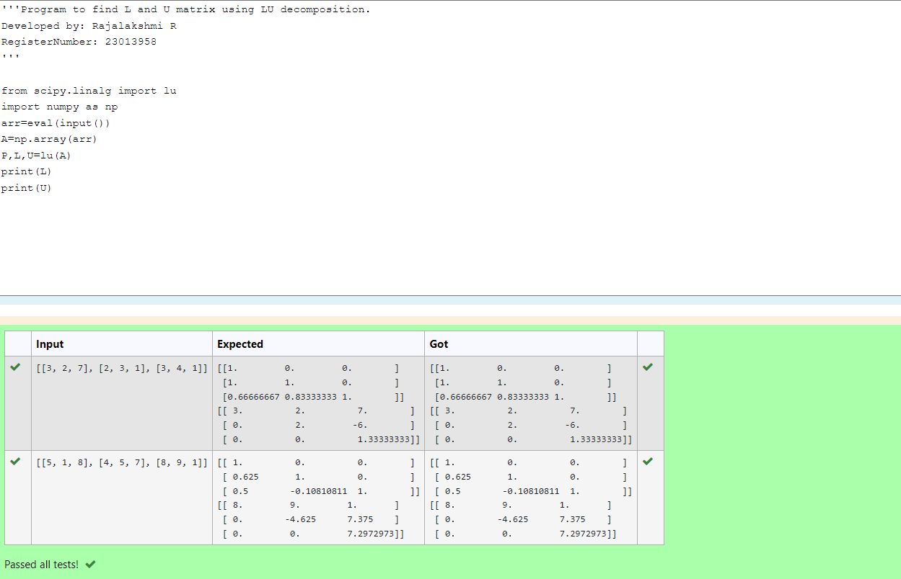
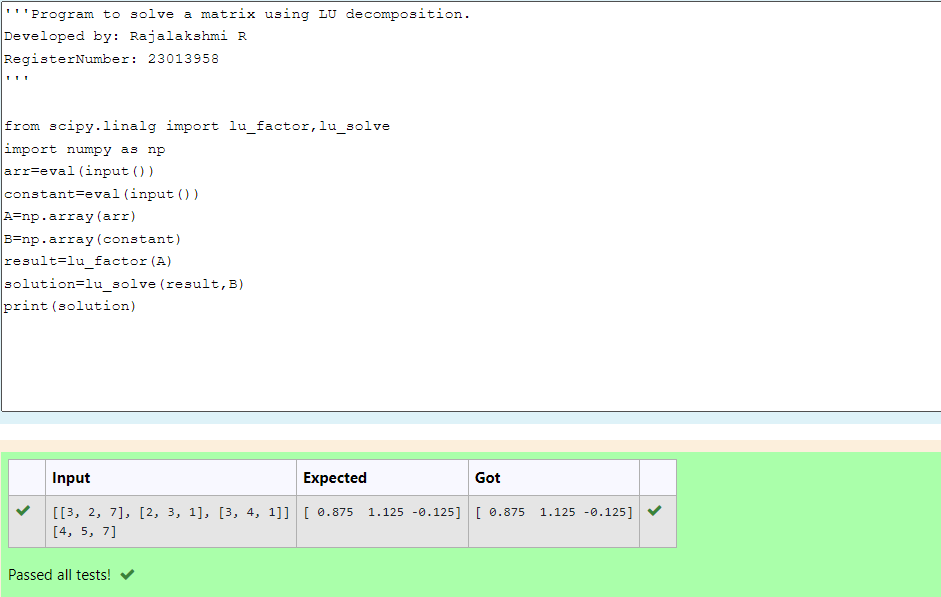

# LU Decomposition 

## AIM:
To write a program to find the LU Decomposition of a matrix.

## Equipments Required:
1. Hardware – PCs
2. Anaconda – Python 3.7 Installation / Moodle-Code Runner

## Algorithm

1. start the program

2. import numpy in program

3. using np.array find the L and U in the given matrix

4. stop the program

## Program:

(i) To find the L and U matrix

```
from scipy.linalg import lu
import numpy as np
arr=eval(input())
A=np.array(arr)
P,L,U=lu(A)
print(L)
print(U)
```

(ii) To find the LU Decomposition of a matrix

```
from scipy.linalg import lu_factor,lu_solve
import numpy as np
arr=eval(input())
constant=eval(input())
A=np.array(arr)
B=np.array(constant)
result=lu_factor(A)
solution=lu_solve(result,B)
print(solution)
```

## Output:

(i) To find the L and U matrix


(ii) To find the LU Decomposition of a matrix


## Result:
Thus the program to find the LU Decomposition of a matrix is written and verified using python programming.